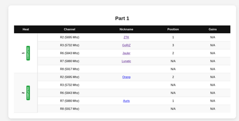
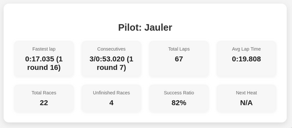
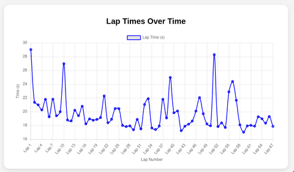
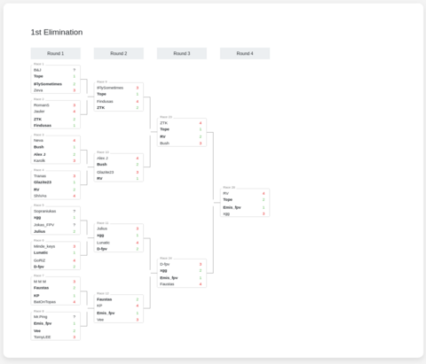
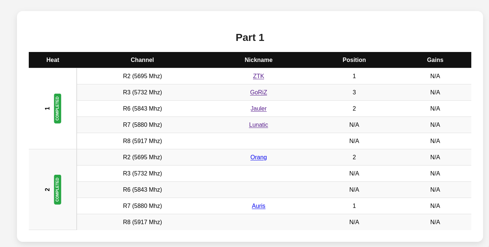

# DroneRaceView

Race view is a small ad-hoc website designed to take data directly from [RotorHazard](https://rotorhazard.com/) timing system and vizualise it in a way accessible to anyone with internet connection.
It is intended to be race-format-specific meaning that it may show information about progression of the race according to its format.
But the flip side of the coin is that a timer setup has to match what is expected by the RaceView

## Showcase

### Listing heats and assigned channels to pilots

DroneRaceView can show heats with pilots and assigned channels to them:

### Displaying per-pilot specific information

DroneRaceView may show various kind of information about each participating pilot, like some generic statistics:

Or a graph of all lap times of a pilot:

Or information about each flight:

### Displaying race progression and results

Elimination brackets:

Or Qualifying ranking:

## Getting started

See [Getting Started](doc/getting-started.md) for more information.

## Notable uses

DroneRaceView has been succesfully used in:
- [picnic](https://www.fpvsports.lt/baltosios-vokes-dronu-sodo-trasos-atidarymas) race utilizing simplified King Of The Hill format.
- [Hobiverse x Comicon 2025 cup](https://www.fpvsports.lt/hobiverse-x-comic-con-drone-racing-cup-2025) race utilizing double-elimination brackets format
- Several small local races

