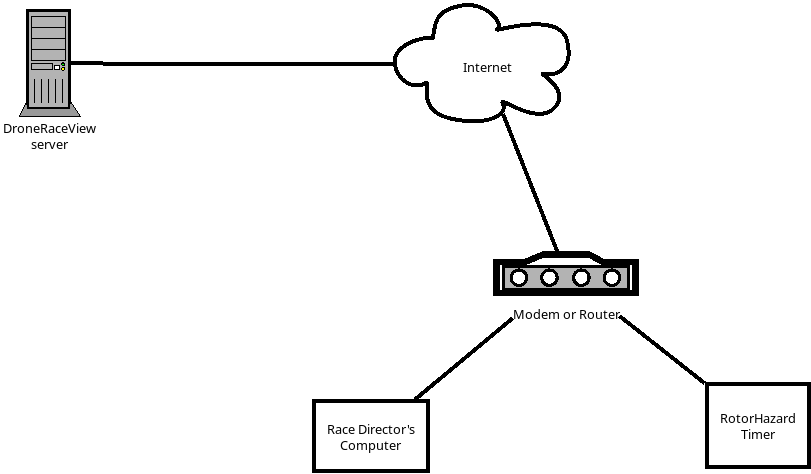

# Establishing WireGuard tunnel

It is likely, that eventually one will want to have the results accessible over wider internet with DroneRaceView running on some server somewhere on the internet.
But as one of the prerequisites is for the DroneRaceView to have direct access to the RotorHazard timing system.
In order to achieve that one may establish a WireGuard tunnel from the timer to the DroneRaceView server.

In the end, the setup would look something like this:

Although in same cases Race Director's computer may act as Modem/Router if configured to do so.

