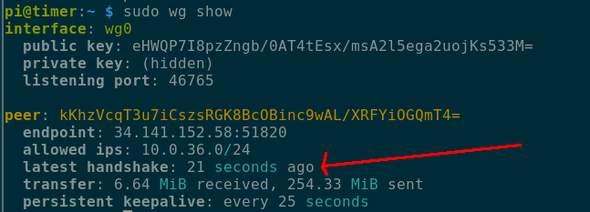

# Establishing WireGuard tunnel

It is likely, that eventually one will want to have the results accessible over wider internet with DroneRaceView running on some server somewhere on the internet.
But as one of the prerequisites is for the DroneRaceView to have direct access to the RotorHazard timing system.
In order to achieve that one may establish a WireGuard tunnel from the timer to the DroneRaceView server.

In the end, the setup would look something like this:


Although in same cases Race Director's computer may act as Modem/Router if configured to do so.

## Configuring WireGuard tunnel

The following steps describe how to setup wireguard tunnel

### Step 1. Installing WireGuard tools

execute the following on both, DroneRaceView server and raspbery pi running RotorHazard:
```bash
sudo apt install wireguard
```

### Step 2. Generate keys

execute the following command on both, DroneRaceView and raspberry pi running RotorHazard:
```bash
wg genkey | tee >(echo -n "Private Key: "; cat) | wg pubkey | awk '{print "Public Key: " $0}
```
And securely remember the output for both, private key and public key.

__Note 1:__ Technically you can generate keys for both endpoints on single machine (e.g. both on DroneRaceView, or both on RPi, but it is easier to keep track of which key is which this way)
__Note 2:__ Never share private key anywhere publically

### Step 3. Configure WireGuard endpoint on DroneRaceView server

On DroneRaceView server create a file `/etc/wireguard/wg0.conf` and populate with the following contents

```
[Interface]
PrivateKey=<Private Key generated on DroneRaceView at step 2>
Address=10.0.36.152/24
ListenPort=51820

[Peer]
PublicKey=<Public Key generated on Raspberry pi at step 2>
AllowedIps=10.0.36.68/32
```

### Step 4. Start WireGuard server on DroneRaceView

```bash
sudo systemctl enable --now wg-quick@wg0
```

### Step 5. Configure WireGuard endpoint on Raspberry pi

In a similar fashion like we did on step 3, lets create a file `/etc/wireguard/wg0.conf` on Raspberry Pi:
```
PrivateKey=<Private Key generated on Raspberry pi at step 2>
Address=10.0.36.68/24

[Peer]
PublicKey=<Public Key generated on DroneRaceView at step 2>
Endpoint=<Your IP or domain of DroneRaceView server>:51820
AllowedIps=10.0.36.0/24
PersistentKeepalive=25
```

__Note 1:__ Do not forget to replace relevant keys and `Endpoint` in the example above
__Note 2:__ The while private keys must always stay one the same machine it was generated, the public keys must form criss-cross pattern, e.g. generated on DroneRaceView, but configured on RaspberryPi or generated on RaspberryPi, but configured on DroneRaceView server.

### Step 6. Enable Wireguard on RaspberryPi

```bash
sudo systemctl enable --now wg-quick@wg0
```

### Step 7. Verify connection

Issue the following command:
```bash
sudo wg show
```

and search for "latest handshake" field, for example the following output means that the connection has been succesfully established:



Now you may use IP address of `10.0.36.68` to access RotorHazard timer on DroneRaceView server, for example `--url http://10.0.36.68:8000`


