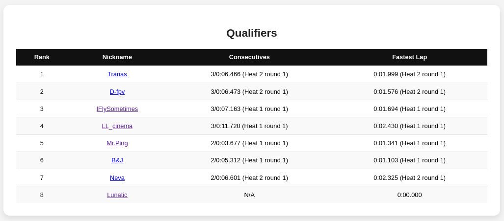

# Timer Setup

In order to enable DroneRaceView to visualize race progression and results with the context of race format - race-format-specific timer setup must be prepared.
This page lists a few such configurations.

## Prerequisites

### DroneRaceView configuration

This assumes that all the required DroneRaceView configuration is already done and all the connections (e.g. WireGuard if necessary) is established. 
See [Getting Started](getting-started.md) for more info.

### Frequency setup

In order to show frequencies in various tables, DroneRaceView takes them from the "Frequency Setup" tab in "Settings" page in RotorHazard timer.
You may setup your channels hoewer you like, but here is an example setup where channels:
- R2
- R3
- R6
- R7

are being used:

## Heats view

Heats are displayed directly from the timer, therefore configuring classes and heats in timer will immediately prompt DroneRaceView to show them.

For example, create a class called "Part 1" in RotorHazard "Format" page:

And then add a few heats and pilots:

This results in the following table showing up:

## Race formats

Currently the following result formats has been added to DroneRaceView:
- points - a results view showing a table of cumulative points of each pilot and a graph of progression. This view was used during race with "King Of The Hill" race format
- consecutives - A most common view which displays a table of pilots ranked by best consecutive time
- eliminations - A view showing elimination brackets
- finals - A view showing progression of finals where pilots compete until one of the pilots wins two times

### Consecutives

Consecutives is generally the simplest to setup.

__Step 1:__ Create a race format, which has "display=consecutives" in its name.

__Step 2:__ Assign this race format to the class

__Step 3:__ Do some races and verify that consecutives table is being displayed in `/results`

Consecutive results form all classes having `display=consecutives` in its assigned race format is merged into one and shown in a single table.

### points

__Step 1:__ In the same manner like for "Consecutives" view, prepare a Race Format which has `display=points` in its name.

__Step 2:__ In the "Race Format" setup "Points Assignment" to be "Position" (and setup point value for each position by clicking gear icon.

__Step 3:__ In the same manner like for "Consecutives view - assign this Race Format to a class intended for points accumulation

__Step 4:__ In a class for which points are being calculated - select "Ranking" to be "Cumulative Points"

__Step 5:__ Do some races, and observe the point table and progression table being shown

